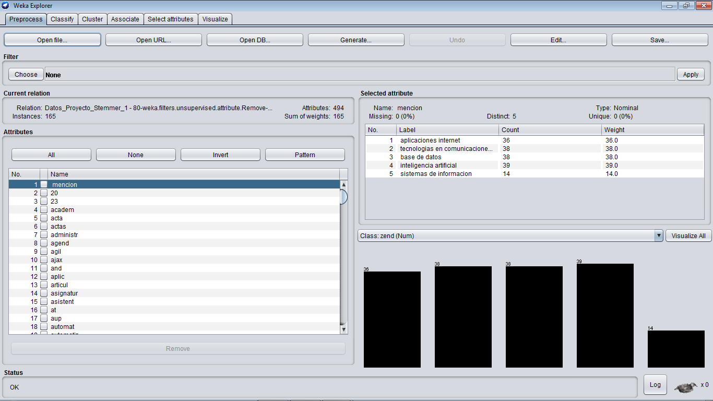
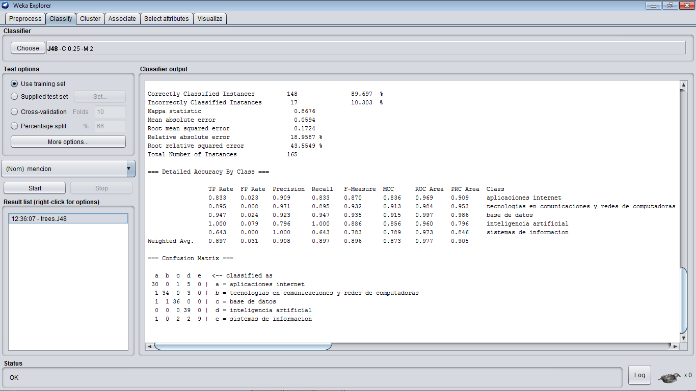
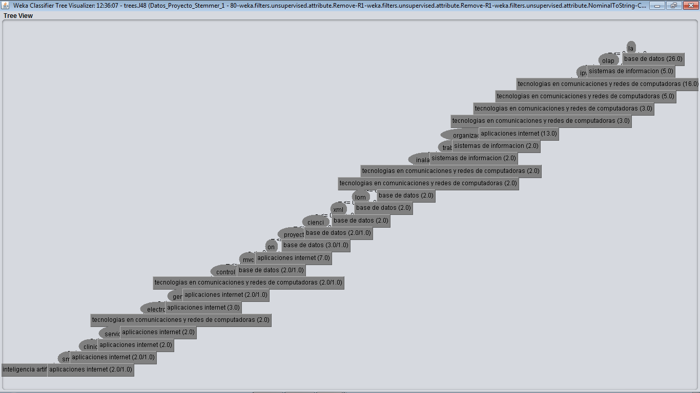
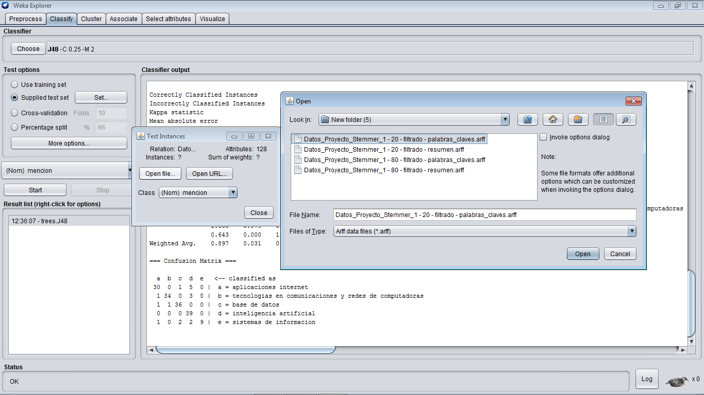
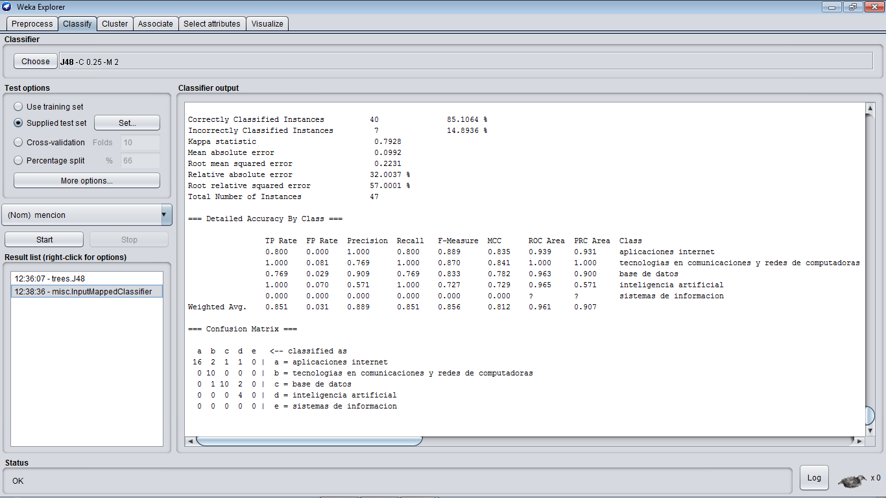
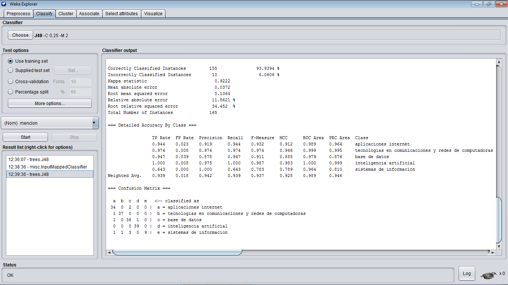
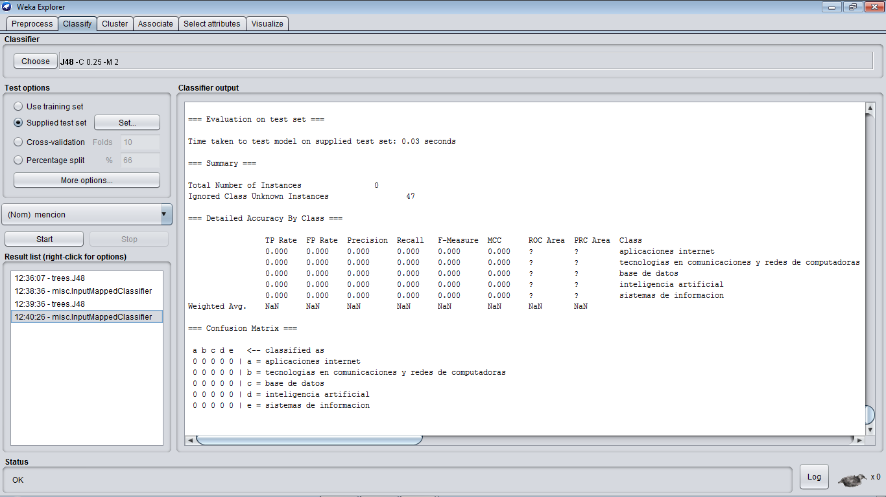

#Proyecto Fase #2 - Minería De Datos
- - - -

>Para la segunda etapa se debe haber completado la minería sobre los datos. Para esta fase se debe entregar:

> - Un documento que explique los pasos realizados para hallar los patrones que permiten conseguir la
mención a la que pertenece cada TEG.
> - Una aplicación que dado los datos de un nuevo TEG pueda predecir a que mención pertenece.

## Estructura del Repositorio
- - - -

* [Clasificador.py] - Es el script que toma el archivo .txt las palabras claves de un TEG y muestra la mecion.
* [In/] - Es la carpeta donde esta el archivo de entrada.
* [PythonData/] - Es la carpeta que contiene el "virtual environment" de `Python 3.5`.

## Ejecucion del Programa
- - - -

Mediante el uso del árbol de decisión generado por WEKA se pasmo este árbol en una aplicación en Python que lee del archivo [Datos_Proyecto_Clasificar.txt] ubicado en la carpeta [In/] las palabras claves de cada TEG e imprime por consola la mención a la que se presume corresponde.

Para la ejecución del programa basta con colocar el archivo [Datos_Proyecto_Clasificar.txt] dentro de la carpeta [In/], luego debemos abrir una terminal y cargar el "virtual environment" de `Python 3.5`.

```bash
Mineria De Datos>PythonData\Scripts\activate.bat

(PYTHON~1) Mineria De Datos>python Clasificador.py
aplicaciones internet
tecnologias en comunicaciones y redes de computadoras
base de datos
tecnologias en comunicaciones y redes de computadoras
inteligencia artificial
inteligencia artificial
...
```

Esto será suficiente para obtener en la salida de la consola la mencion correscpondientes a las palabras claves de cada linea del archivo de entrada.

## Preparación antes del análisis:
- - - -

Para poder llevar a cabo la búsqueda de patrones dentro de los datos se usó la técnica de clasificación por medio de árboles de decisión. 
Primeramente, se hicieron algunos ajustes adicionales previo al estudio de los datos, como por ejemplo crear dos archivos distintos, uno con los atributos “palabras_clave – mención”, y otro con los atributos “resumen – mención”, luego tanto el atributo “palabras_clave” y “resumen”, se les realizó un filtrado por medio de WEKA para convertirlo a un string y después transformarlos a un WordVector, usando herramientas de filtrado de WEKA. De esta manera el estudio posterior de los datos va a ser posible.
Antes de aplicar un proceso de clasificación es usual dividir los datos de entrada (training set) en dos partes, una de alrededor de un 60% - 80%, este conjunto más grande es el usado para crear el modelo, y los datos restantes son usados como datos de prueba (test set) en WEKA para medir la precisión del modelo creado. Este último paso se hace para evitar un problema de sobreajuste, ya que, si le damos demasiados datos a nuestro modelo, el mismo será realmente bueno, pero solo para ese conjunto de datos. Y el objetivo de este proyecto es encontrar un modelo que permita predecir en un futuro que menciones deben ser asignadas, y para testear nuestro modelo se usará la otra parte de esta forma nos aseguramos de que la precisión de nuestro modelo no disminuirá con datos nuevos.

### Son creados los archivos:
- [Datos_Proyecto_Stemmer_1 - 20 - filtrado - palabras_claves.arff]
- [Datos_Proyecto_Stemmer_1 - 20 - filtrado - resumen.arff]
- [Datos_Proyecto_Stemmer_1 - 80 - filtrado - palabras_claves.arff]
- [Datos_Proyecto_Stemmer_1 - 80 - filtrado - resumen.arff]

## Algoritmo utilizado:
- - - -

C4.5 es un algoritmo usado para generar un árbol de decisión desarrollado por Ross Quinlan. C4.5 es una extensión del algoritmo ID3 desarrollado anteriormente por Quinlan. Los árboles de decisión generador por C4.5 pueden ser usados para clasificación, y por esta razón, C4.5 está casi siempre referido como un clasificador estadístico.
C4.5 construye árboles de decisión desde un grupo de datos de entrenamiento de la misma forma en que lo hace ID3, usando el concepto de entropía de información. Los datos de entrenamiento son un grupo de elementos de ejemplos ya clasificados. Cada elemento es un vector donde se representan los atributos o características del ejemplo.
En cada nodo del árbol, C4.5 elige un atributo de los datos que más eficazmente dividen el conjunto de muestras en subconjuntos enriquecidos en una clase u otra. Su criterio es el normalizado para ganancia de información (diferencia de entropía) que resulta en la elección de un atributo para dividir los datos. El atributo con la mayor ganancia de información normalizada se elige como parámetro de decisión. El algoritmo C4.5 divide recursivamente en sub-listas más pequeñas.
J48 es una implementación de código abierto en lenguaje de programación Java del algoritmo C4.5 integrado en la herramienta WEKA, debido a esto y a sus características optamos por este algoritmo para generar el árbol de toma de decisión.

## Proceso de Minería de Datos:
- - - -

Comenzamos con el archivo [Datos_Proyecto_Stemmer_1 - 80 - filtrado - palabras_claves.arff], una vez cargado en WEKA, en la pestaña Classify se seleccionó el algoritmo a usar para crear el árbol de decisión, en este caso es el J48 y se ejecutó la función.





Los resultados obtenidos se encuentran en [j48_de_palabras_claves.txt].
El árbol se puede observar al hacer clic derecho sobre la ventana de resultados y seleccionar Visualizar árbol.



En este caso no ayuda mucho, así que se procede a interpretar lo arrojado por el Classifier output.
Una vez obtenidos los resultados se procede a su análisis, en primer lugar, se observa que por el momento el modelo obtenido cuenta con una precisión bastante alta (Correctly Classified Instances) de alrededor de un 90%. Este valor es bastante bueno para continuar trabajando con este modelo.
Observando luego la matriz de confusión generada es fácil darse cuenta de que no hubo muchos falsos positivos o falsos negativos. Por ejemplo, de las 36 instancias pertenecientes a la mención “aplicaciones internet”, solo 6 van a ser clasificadas de manera incorrecta, de igual manera de las 38 instancias pertenecientes a la mención base de datos solo 2 van a ser clasificadas incorrectamente usando este modelo. 
Esto último nos hace pensar que realmente el modelo generado no dista mucho de la realidad. Ahora solo hay que probarlo con los datos restantes para saber si la precisión del modelo se mantiene con datos nuevos.
Ahora se selecciona la opción Supplied test Set, con la cual se probará el modelo creado. Usando el archivo [Datos_Proyecto_Stemmer_1 - 20 - filtrado - palabras_claves.arff]. 



Al ejecutarlo de nuevo, se obtienen unos nuevos resultados, (Correctly Classified Instances) tiene un valor de 85%, muy parecido al obtenido anteriormente al generar el modelo, esto indica que el modelo realmente es muy bueno y valido para poder predecir el atributo mención dados unas palabras claves correspondientes a unas TEG.



Por otro lado, se procede a ejecutar los mismos pasos, pero esta vez con los atributos resumen – mención. Al usar el algoritmo J48 sobre [Datos_Proyecto_Stemmer_1 - 80 - filtrado - palabras_claves.arff] se obtienen los resultados mostrados en el archivo [j48_de_resumen.txt], muestra una precisión de 93%, qué es increíblemente alta.  La matriz de confusión también parece muy buena.



Para probar que tan fiable es este modelo se continúa con la prueba del mismo por medio del archivo [Datos_Proyecto_Stemmer_1 - 20 - filtrado - resumen.arff], y al hacerlo se obtienen resultados muy interesantes, prácticamente el nuevo output  está vacío. (Incorrectly Classified Instances) indica que tantas instancias fueron clasificadas incorrectamente, y en este caso de las 47 instancias de prueba, ninguna pudo ser clasificada de manera acertada. El modelo no funciona correctamente.



## Conclusiones:
- - - -

- El primer modelo creado con el atributo “palabras_claves” es sin duda el modelo correcto para predecir la mención dado un nuevo conjunto de datos. Esto se debe a su alta precisión incluso al ser testeado con conjunto de datos desconocidos, aun así, puede haber ciertas equivocaciones, pero en general y en la mayoría de los casos tenderá a comportarse de manera correcta.
- Si se observa con detenimiento el archivo de salida de este modelo se podrá ver la forma del árbol y por medio de este encontrar la mención dada un nuevo conjunto de datos.
- A diferencia del segundo modelo que a pesar de que tenía un alto nivel de precisión, al ser probado con datos nuevos es incapaz de predecir a que mención se está haciendo referencia.
- En base a esto se puede decir que atributo resumen, al ser muy subjetivo y expuesto a las redacciones propias de cada persona al hacerla, hace que sea muy difícil determinar por medio de este de que mención se está tratando, dado un resumen en alguna instancia.
- Sin duda, para algunas personas puede parecer algo absurdo pensar que el resumen de alguna instancia no ayude a predecir alguna mención, ya que normalmente se escribe acerca de cómo es una TEG, pero hay que recordar que a diferencia del atributo “palabras_claves”, no es tan preciso, ya que puede poseer palabras que no tengan nada que ver con la mención directamente y que no influyan en nada en la predicción de una mención. Caso contrario, “palabras_clave” solo posee las palabras que son realmente importantes e identifican a la mención, logrando obtener un resultado más confiable.

## Autores
- - - -
**Nombre:** Efrain Diaz  
**C.I.:** 24.888.992  
**E-Mail:** uriel.eudp@gmail.com

**Nombre:** Jorge Khabazze  
**C.I.:** 23.692.079  
**E-Mail:** jtkm6jk@gmail.com

   [Clasificador.py]: <./Clasificador.py>
   [In/]: <./In/>
   [PythonData/]: <./PythonData/>
   [Datos_Proyecto_Stemmer_1 - 20 - filtrado - palabras_claves.arff]: <./Datos_Proyecto_Stemmer_1-20-filtrado-palabras_claves.arff>
   [Datos_Proyecto_Stemmer_1 - 20 - filtrado - resumen.arff]: <./Datos_Proyecto_Stemmer_1-20-filtrado-resumen.arff]>
   [Datos_Proyecto_Stemmer_1 - 80 - filtrado - palabras_claves.arff]: <./Datos_Proyecto_Stemmer_1-80-filtrado-palabras_claves.arff]>
   [Datos_Proyecto_Stemmer_1 - 80 - filtrado - resumen.arff]: <"./Datos_Proyecto_Stemmer_1-80-filtrado-resumen.arff">
   [Datos_Proyecto_Clasificar.txt]: <./In/Datos_Proyecto_Clasificar.txt>
   [j48_de_palabras_claves.txt]: <./j48_de_palabras_claves.txt>
   [j48_de_resumen.txt]: <./j48_de_resumen.txt>
   [j48_de_palabras claves_test.txt]: <./j48_de_palabras claves_test.txt>
   [j48_de_resumen_test.txt]: <./j48_de_resumen_test.txt>